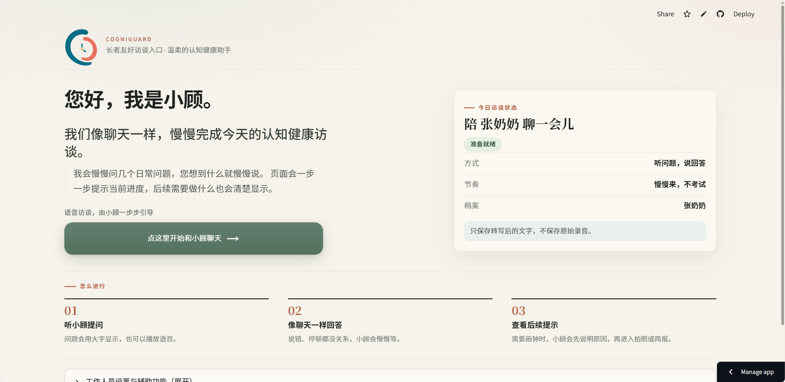

# CogniGuard

**🌐 在线体验 / Live Demo：<https://cogniguard.streamlit.app/>**

CogniGuard 是一个认知健康风险提示原型项目，基于 Streamlit 搭建为本地可运行的 Web Demo。它把自然对话、画钟测试和历史记忆趋势整理成认知健康风险提示，把传统认知筛查中的语言访谈和画钟测试，包装成一个低压力的老人陪伴式 AI 助手：老人端体验是聊天和拍照上传，系统端完成结构化认知评估、历史趋势对比和家属端风险提醒。

> 当前为**中文版本**：访谈问题、示例回答、语音音色、画钟与报告措辞均面向中文用户，整套流程以中文交互为主。

本项目是一个实验性技术原型，不是医疗产品，不做真实临床验证，不训练模型，不给出诊断结论。默认使用 mock/demo 数据，不需要真实 API Key 也能完整跑通主流程。

## 在线体验



打开顶部的「在线体验」链接即可使用：默认 `DEMO_MODE=true`，无需任何 API Key 即可完整体验演示流程；访谈问题的语音朗读使用项目内预置音频（`assets/demo_voice/`），部署后无需联网也能听到声音。

## 功能列表

- 首页入口：侧边栏导航默认隐藏；长者从首页大按钮进入“和小顾聊天”，工作人员在“工作人员设置与辅助功能”中解锁后进入 5 个功能页：快捷访谈评估、画钟测试、认知简报、长者简易版、演示模式。
- 快捷访谈评估：工作人员测试页，以“AI 访谈问题 / 老人回答”的形式逐轮访谈；保留文字输入和示例回答，也支持用户主动录音或上传音频，经 ASR 转写后填入或提交为当前回答；Qwen 生成下一问时可同时返回三类 `sample_answers`，本地规则会校验并兜底，页面生成对话风险提示和对话评估参考分。
- 长者简易版：面向真实老人端低操作负担访谈，进入后只有一个超大开始按钮；系统自动生成并播放高质量 TTS 问题，长者只需使用录音回答，ASR 转写后自动提交并进入下一题，完成后自动整理并保存文字评估结果。
- 演示模式：用于快速演示展示，可选择正常表现、轻度下降或明显异常，自动生成 6 轮模拟访谈；支持一键生成完整流程、按顺序批量生成系统/模拟老人语音、失败语音单独重试、播放完整演示、运行评估并查看报告，页面明确标注这是模拟演示数据，不是真实老人输入。
- 画钟测试：以现场摄像头拍照为主，上传图片或加载示例画钟图片作为兜底，生成 Qwen-VL / mock / fallback 画钟结构化结果，并可保存到 SQLite session。
- 认知简报：默认读取当前演示对象“张奶奶”（`user_id=zhang-nainai`）的 SQLite 记录，优先展示本轮对话 + 画钟合并后的综合评估，包含最近测试时间、测试类型、CogniGuard 综合提示分、最近画钟摘要、认知域得分趋势和家属端提醒；没有记录时会提示先保存结果，也可手动查看 fixture 演示数据。
- 历史趋势：支持 `normal`、`mild_decline`、`fluctuating` 三类模拟轨迹。
- 本地存储：对话和画钟结果默认保存到“张奶奶”的同一次综合评估记录；先保存对话、再保存画钟时会用当前 `assessment_id` 合并到同一条 SQLite session，fixture 数据仅作为可选演示视图。
- 记忆兜底：ChromaDB 不可用时回退到本地 JSON 或内存模式。
- 安全边界：不采集真实医疗数据，不保存上传图片或原始音频，不提交 `.env` 和 `data/`。

## 技术栈

- Web Demo：Streamlit multipage
- 后端逻辑：Python 模块，由 Streamlit 页面直接调用
- 元数据存储：SQLite
- 向量记忆：ChromaDB 嵌入式模式，失败时回退 JSON/内存
- 配置：python-dotenv + `.env`
- 模型接口：OpenAI-compatible API 封装层，文本 LLM / VLM / ASR 默认走 mock/fallback
- 图表：pandas + Streamlit 原生图表
- 测试：pytest

## 创建虚拟环境

Windows PowerShell：

```powershell
python -m venv .venv
.\.venv\Scripts\Activate.ps1
```

macOS / Linux：

```bash
python -m venv .venv
source .venv/bin/activate
```

## 安装依赖

```bash
python -m pip install -r requirements.txt
```

不需要安装额外依赖，不需要本地部署大模型。

“快捷访谈评估”页的手动语音录音入口使用 Streamlit 原生 `st.audio_input`，因此 `requirements.txt` 要求 `streamlit>=1.40`。长者简易页另外使用项目内浏览器录音组件来做一键访谈和停顿自动停止，不需要安装额外依赖。如果本地环境仍是旧版 Streamlit，请重新执行安装依赖或手动升级 Streamlit。

## 推荐 Qwen 统一配置（可选）

不创建 `.env` 时，程序默认 `DEMO_MODE=true`，不需要真实 API Key 也能完整演示。`.env.example` 当前是“真实调用演示模板”：复制成 `.env` 后，如果保留 `DEMO_MODE=false` 并填写有效 `QWEN_API_KEY`，文本、视觉、ASR 和 TTS 会按配置尝试真实调用；如果只想稳定跑 mock demo，请把本地 `.env` 的 `DEMO_MODE` 改回 `true`，或暂时不要创建 `.env`。真实 Key 只写在 `.env` 中，`.env` 已被 `.gitignore` 忽略，不要提交。

推荐 `.env`：

```env
QWEN_BASE_URL=https://dashscope.aliyuncs.com/compatible-mode/v1
QWEN_API_KEY=sk-your-dashscope-api-key
LLM_MODEL=qwen-max
VLM_MODEL=qwen-vl-max
ASR_MODEL=qwen3-asr-flash
TTS_MODEL=qwen-tts
TTS_MODEL_ASSISTANT=qwen-tts
TTS_VOICE_ASSISTANT=Cherry
TTS_MODEL_PATIENT_DEMO=cosyvoice-v3-flash
TTS_VOICE_PATIENT_DEMO=longlaoyi_v3
DEMO_MODE=false
VOICE_DEMO_MODE=false
USE_CACHE=true
```

如果 `LLM_BASE_URL / LLM_API_KEY`、`VLM_BASE_URL / VLM_API_KEY`、`ASR_BASE_URL / ASR_API_KEY` 或 `TTS_BASE_URL / TTS_API_KEY` 留空，系统会自动使用 `QWEN_BASE_URL / QWEN_API_KEY`。只有在某个能力需要单独 endpoint 或单独 Key 时，才填写专用覆盖项：

```env
LLM_API_KEY=sk-dedicated-llm-key
ASR_API_KEY=sk-dedicated-asr-key
TTS_API_KEY=sk-dedicated-tts-key
```

只要 `DEMO_MODE=true`，或对应能力的 base URL、API Key、model 任一缺失，系统都会继续使用 mock/fallback，不会调用真实 API。

## 判断 Qwen LLM 是否生效

打开“快捷访谈评估”页面后，页面顶部会显示当前 `DEMO_MODE`、`LLM_MODEL`、LLM 配置是否完整，以及 API Key 是否已配置。页面不会显示 API Key 内容。

点击“生成评估并判断下一步”后，结果区会显示中文化结果来源：

- “Qwen 文本模型”：真实 Qwen 文本 LLM 调用成功。
- “模拟结果”：仍在稳定演示模式，通常是 `DEMO_MODE=true` 或 LLM 配置不完整。
- “兜底结果”：尝试调用真实 LLM 后失败，或返回内容不是有效 JSON / 未通过 schema 校验，系统已回退到安全兜底结果。

如果需要真实调用，请确认本地 `.env` 中 `DEMO_MODE=false`，并已填写 `QWEN_BASE_URL`、`QWEN_API_KEY` 和 `LLM_MODEL`，或填写了完整的 LLM 专用配置。`.env` 只保存在本地，不要提交到 git。

## Qwen 连接诊断

如果页面显示配置完整但百炼后台没有 token 消耗，可以手动运行最小连接诊断：

```powershell
python scripts\check_qwen_connection.py
```

该脚本会读取本地 `.env`，只打印 `DEMO_MODE`、`LLM_BASE_URL` 是否配置、`LLM_MODEL`、`LLM_API_KEY` 是否配置，不会打印 API Key。脚本会向 Qwen 发起一个最小 Chat Completions 请求，要求模型返回 `{"ok": true}`。成功时会显示 `Qwen API connection succeeded` 和模型返回内容；失败时会显示异常类型和已脱敏的安全错误信息。

该诊断脚本只供手动运行，不属于默认 pytest；默认测试仍不联网。

## 配置 ASR 语音转写（可选）

默认 `DEMO_MODE=true` 时，快捷访谈评估页的录音和上传音频都会走 mock ASR，不需要真实 API Key。推荐使用统一 Qwen 配置和 `ASR_MODEL=qwen3-asr-flash`：

```env
QWEN_BASE_URL=https://dashscope.aliyuncs.com/compatible-mode/v1
QWEN_API_KEY=sk-your-dashscope-api-key
ASR_MODEL=qwen3-asr-flash
DEMO_MODE=false
USE_CACHE=true
```

`qwen3-asr-flash` 适合短语音回答转写：录音或上传一段老人回答，页面立即送去 ASR 并拿回文本。`qwen3-asr-flash-filetrans` 更适合长录音、文件级异步转写；`qwen3-asr-flash-realtime` 可留到后续半实时语音访谈再考虑。

进入“快捷访谈评估”页面后，在当前 AI 访谈问题下方的“语音回答”区域，可以点击录音控件并授权麦克风，也可以上传 `wav/mp3/m4a/mp4/webm/ogg` 音频。点击“转写录音”或“转写上传音频”后，页面会显示 ASR 来源、模型和转写文本；随后可以点击“填入回答框”继续手动检查，或点击“提交为当前回答”直接进入原有对话流程。

快捷访谈评估页的语音回答只在用户明确点击录音或上传音频后工作，不做自动 VAD、不做全双工实时语音。长者简易页为降低操作负担，会在用户点击开始并授权麦克风后进行可见的浏览器端静音检测，用于自动停止本轮录音；它也不是后台监听或全双工实时语音。页面不会保存原始音频，SQLite 和记忆层只会保存最终提交的转写文本。

手动 ASR 连接诊断：

```powershell
python scripts\check_asr_connection.py path\to\answer.wav
```

未传入音频路径时，脚本只打印用法并退出，不会联网。传入音频路径后，脚本会读取本地 `.env`，只打印 `QWEN_BASE_URL`、`QWEN_API_KEY`、最终 `ASR_BASE_URL`、`ASR_MODEL` 和 `ASR_API_KEY` 是否已配置，不打印 API Key；`DEMO_MODE=true` 或 ASR 配置不完整时会返回 mock 提示。

## 配置 TTS 系统问题播放（可选）

“系统语音播放”为可选功能：当前 AI 访谈问题仍会以文本显示，系统语音不会后台自动播放，必须由用户点击触发。页面提供两种系统语音模式：

- 高质量 TTS：默认模式，使用 Qwen-TTS 合成系统问题，音质较好但首次合成可能需要数秒到十几秒；后续相同 `text + model + voice + format` 会优先读取本地缓存，重复播放会更快。没有 TTS Key、`DEMO_MODE=true`、`VOICE_DEMO_MODE=true` 或 API 失败时，页面会显示 mock/fallback 提示，不会崩溃，文本访谈流程仍可继续。
- 快速朗读（浏览器）：使用浏览器本地 `speechSynthesis` 朗读当前问题，适合低延迟演示，不调用 Qwen-TTS，不消耗 TTS API，不读取麦克风，也不保存音频；音色取决于浏览器和操作系统。

如果后续需要更低延迟且更稳定的服务端音色，可再升级到实时流式 TTS。

推荐继续复用统一 Qwen 配置：

```env
QWEN_BASE_URL=https://dashscope.aliyuncs.com/compatible-mode/v1
QWEN_API_KEY=sk-your-dashscope-api-key
TTS_MODEL=qwen-tts
TTS_MODEL_ASSISTANT=qwen-tts
TTS_VOICE_ASSISTANT=Cherry
TTS_MODEL_PATIENT_DEMO=cosyvoice-v3-flash
TTS_VOICE_PATIENT_DEMO=longlaoyi_v3
TTS_FORMAT=mp3
DEMO_MODE=false
VOICE_DEMO_MODE=false
```

如需单独覆盖 TTS endpoint 或 Key，可填写 `TTS_BASE_URL` / `TTS_API_KEY`；留空时默认使用 `QWEN_BASE_URL` / `QWEN_API_KEY`。系统声音和模拟老人声音可以使用不同模型与音色：系统提问优先使用 `TTS_MODEL_ASSISTANT=qwen-tts` 与 `TTS_VOICE_ASSISTANT=Cherry`；演示中的模拟老人回答优先使用 `TTS_MODEL_PATIENT_DEMO=cosyvoice-v3-flash` 与 `TTS_VOICE_PATIENT_DEMO=longlaoyi_v3`。`TTS_MODEL` 仍保留为旧配置兼容默认值。修改本地 `.env` 后需要重启 Streamlit 才能让新模型或新音色生效。

`longlaoyi_v3` 是用于演示的老人音色 ID，通常需要搭配 CosyVoice-v3 系列模型和账号音色权限；如果把它发送给 `qwen-tts`，或当前账号/模型不支持该音色，TTS client 会走 fallback，页面不会崩溃，文本演示和评估流程仍可继续。系统高质量语音来自 Qwen-TTS 合成，系统快速朗读来自浏览器本地语音，老人回答来自麦克风录音或上传音频并经 ASR 转写，三者来源不同。页面不会保存原始用户语音；TTS 缓存只保存系统问题或演示模拟文本的合成音频，位于 `data/voice_cache/`，该目录已被 `.gitignore` 忽略，不应提交。这个功能仍不是实时语音助手：Qwen-TTS 是非实时高质量合成，浏览器快速朗读只是低延迟演示模式。

## 预置演示语音（让默认演示出声）

默认 `DEMO_MODE=true` 时，TTS 走 mock、不会真实调用 API，因此线上演示原本是“无声”的。为了让默认演示也能听到问题朗读，项目支持把固定演示文案（预设访谈问题、演示模式三档对话）预先合成为音频并提交进仓库：`core/tts_client.synthesize_speech` 在 `DEMO_MODE=true` / `VOICE_DEMO_MODE=true` 下会先按 `文本 + 模型 + 音色 + 格式` 的摘要查 `assets/demo_voice/`，命中就直接返回这份真实音频（来源标记 `static_audio`），否则照旧返回 mock。这样部署后无需任何运行时 API Key 也有声音。

预置音频需要在本地用真实 Key 离线生成一次（会消耗 token），再提交进仓库：

```powershell
# 本地 .env 配好 QWEN_API_KEY / QWEN_BASE_URL 后运行（脚本内部会真实调用 TTS）
python scripts\generate_demo_voice.py

# 只生成系统问题语音（qwen-tts / Cherry），跳过模拟老人音色
python scripts\generate_demo_voice.py --assistant-only
```

脚本会把音频写入 `assets/demo_voice/` 并生成 `manifest.json` 清单，随后 `git add assets/demo_voice/` 提交即可。系统音色（`qwen-tts` / `Cherry`）一般都能成功；模拟老人音色（`cosyvoice-v3-flash` / `longlaoyi_v3`）需要账号音色权限，失败会跳过并提示，不影响系统语音出声。脚本只读本地 `.env`，不会打印或提交 API Key。

## 长者页与演示页

“长者简易访谈”页面适合演示真实老人端低操作负担流程：点击超大“点这里开始”按钮后，系统自动准备并播放当前问题；浏览器会请求麦克风权限，页面会用大字显示“正在播放问题 / 正在听您回答 / 正在识别”。长者听完后直接说话即可，前端使用 `MediaRecorder` 和浏览器端音量静音检测，在回答后停顿时自动停止录音并把该段音频交给 ASR；页面仍保留“我说完了”兜底按钮，防止环境噪声导致自动停止不触发。该页不提供上传音频、文字编辑、播放模式切换或手动提交按钮；ASR 转写成功后会自动提交文字回答并准备下一题，覆盖主要认知域后自动生成并保存评估。默认保存对象仍是“张奶奶”，页面不保存原始用户语音到磁盘，只保存提交后的转写文本。麦克风不会在用户点击开始前打开，监听状态必须在页面上可见。

“演示模式”页面适合快速展示：先选择“正常表现 / 轻度下降 / 明显异常”，点击“生成完整演示流程”后页面会生成 6 轮模拟访谈时间线；再点击“生成全部演示语音”按轮次顺序合成系统问题和模拟老人回答，缓存命中会直接复用，已成功的片段不会重复请求。为了保证 CosyVoice 老人音色稳定，模拟老人回答默认串行生成；首次批量生成可能较慢。若部分语音生成失败，页面会保留其他成功音频并显示失败原因，可点击“重试失败语音”只重试失败片段。点击“播放完整演示”后，页面提供顺序播放区，按“系统问题 → 模拟老人回答”播放。若浏览器限制连续播放，页面保留按轮次排列的备用音频控件。最后点击“运行评估并查看报告”，模拟回答文本会直接进入 `evaluate_dialogue`，不会再走 ASR，也可保存为张奶奶的一次演示评估。系统问题默认使用 `TTS_MODEL_ASSISTANT=qwen-tts` + `TTS_VOICE_ASSISTANT=Cherry`，模拟老人回答默认使用 `TTS_MODEL_PATIENT_DEMO=cosyvoice-v3-flash` + `TTS_VOICE_PATIENT_DEMO=longlaoyi_v3`；页面顶部会显示当前读取到的模型和音色。该页面始终提示“模拟演示数据，不是真实老人输入”。

手动 TTS 连接诊断：

```powershell
python scripts\check_tts_connection.py "请您把这串数字倒着说一遍：7-2-5。"
```

不传文本时脚本会使用默认中文短句。脚本默认使用缓存，会打印 `cached=true/false` 和 `audio_size`；如果想绕过缓存重新检查真实合成，可加 `--no-cache`：

```powershell
python scripts\check_tts_connection.py --no-cache "请您把这串数字倒着说一遍：7-2-5。"
```

如果要检查演示中的模拟老人声音，可以指定角色：

```powershell
python scripts\check_tts_connection.py --role patient "今天早上我看了手机上的日期。"
```

也可以临时覆盖模型或音色：

```powershell
python scripts\check_tts_connection.py --role patient --model cosyvoice-v3-flash --voice longlaoyi_v3 "今天早上我看了手机上的日期。"
```

脚本只打印 `DEMO_MODE`、`VOICE_DEMO_MODE`、Qwen/TTS 配置是否存在、最终模型、最终音色、结果来源和音频大小，不打印 API Key。`qwen-tts` 适合短问题朗读；`longlaoyi_v3` 这类老人音色若单条诊断成功但批量生成部分失败，通常优先考虑接口限流、超时或批量请求节奏问题，可在演示页点击“重试失败语音”。后续若进入半实时语音访谈，再单独评估实时 TTS 或 WebSocket 方案。

## 配置 Qwen-VL 画钟分析（可选）

默认 `DEMO_MODE=true` 时，画钟测试页继续使用 mock。要在本地试用 Qwen-VL，可以在 `.env` 中配置：

```env
VLM_BASE_URL=https://dashscope.aliyuncs.com/compatible-mode/v1
VLM_API_KEY=sk-your-qwen-api-key
VLM_MODEL=qwen-vl-max
DEMO_MODE=false
USE_CACHE=true
```

也可以使用 `VLM_MODEL=qwen-vl-plus`。如果已配置 `QWEN_BASE_URL / QWEN_API_KEY`，`VLM_BASE_URL / VLM_API_KEY` 可以留空。真实 Key 只写在本地 `.env`，不要提交。

进入“画钟测试”页面后，顶部会显示 `DEMO_MODE`、`VLM_MODEL`、VLM 配置是否完整和 API Key 是否已配置。页面当前固定目标时间为 `11:10`，不再在页面开放目标时间编辑。拍照、上传图片或加载示例图后点击“分析画钟图片”，结果区会显示中文化结果来源：

- “Qwen-VL 视觉模型”：真实 Qwen-VL 调用成功。
- “模拟结果”：仍在演示模式，通常是 `DEMO_MODE=true` 或 VLM 配置不完整。
- “兜底结果”：尝试调用真实 VLM 后失败，或返回内容不是有效 JSON / 未通过 schema 校验。

手动连接诊断：

```powershell
python scripts\check_qwen_vl_connection.py path\to\clock.png
```

未传入图片路径时，脚本只打印用法并退出，不会联网。传入图片路径后，脚本会读取本地 `.env`，只打印安全配置状态，不打印 API Key。

## 快速 Demo 样本

默认演示对象是“张奶奶”（`user_id=zhang-nainai`）。快捷访谈评估页主流程为“生成下一问 → 当前 AI 访谈问题 → 示例回答或手动回答 → 提交回答 → 生成评估并判断下一步”。当前 AI 问题下方会显示“下一问来源：Qwen 文本模型 / 预设问题 / 兜底结果”和当前覆盖域；真实 LLM 不可用或 Qwen 返回不适合老人访谈的问题时，会回退到生活化预设问题。Qwen 下一问 JSON 可包含 `sample_answers.normal/mild_decline/vague`，页面会优先使用这些示例回答，但会先经过本地规则校验：倒背数字会强制反转当前题目里的数字串，记词题会提取题目中的词，位置/路线问题会围绕左右和路径回答，避免答非所问的模板。访谈最多覆盖 orientation、memory、language、executive_function、attention、visuospatial 一轮；主要认知域覆盖后页面会提示可以点击“生成评估并判断下一步”，并查看中文化结果来源和对话评估参考分。

画钟测试页默认使用摄像头拍照：把画好的纸面放入画面后点击拍照，系统会检查图片、自动分析并自动保存。页面也提供三个示例图：“正常表现示例”“轻度下降示例”“明显异常示例”；摄像头不可用时可展开备选方式，选择后点击“加载示例画钟”预览，再点击“分析画钟图片”调用 `analyze_clock_image`。如果当前浏览器会话里已经保存过本轮对话评估，画钟结果会合并进同一个 `assessment_id`，形成“张奶奶的一次综合评估”；如果没有当前评估，则创建一条画钟测试记录。`clock_result`、`cdt_features`、`source`、`model` 和目标时间会进入 `raw_json`，认知简报页会优先读取这些当前用户记录。若“张奶奶”暂无记录，认知简报页会提示先在对话评估或画钟测试页保存结果；fixture 演示数据需要在页面中手动选择查看。页面当前使用的示意图位于 `assets/classroom_clock_samples/`。

页面会把内部枚举显示为中文标签，例如 `low/medium/high/unknown` 显示为低风险/中等风险/高风险/无法评估，`qwen/qwen-vl/mock/fallback` 显示为 Qwen 文本模型/Qwen-VL 视觉模型/模拟结果/兜底结果，CDT 特征中的 `right_shifted`、`crowded`、`target_time_match=false` 等也会显示为向右偏移、拥挤、不符合目标时间。底层 JSON schema 仍保留英文 key，方便测试和模型输出校验。认知简报页会先展示“最近一次测试报告”和证据，再展示最近画钟摘要，最后展示趋势摘要、得分趋势和家属端提醒。

页面包含三类原型分数：对话评估参考分只根据本次对话可用认知域得分计算；画钟结构分是基于 CDT 结构化特征的 0-10 演示用结构分；CogniGuard 综合提示分是 0-100 的综合风险提示指标，优先根据当前记录可用认知域分数均值计算，并用风险等级做提示性上下限约束：低风险对应 75-100，中等风险对应 50-74，高风险不高于 49，无法评估时显示暂无。全正确对话和正常画钟通常应显示较高分：完全正确的对话域可被提示到 0.95-1.0，正常画钟 10/10 时 visuospatial 和 executive_function 会校准到至少 0.9；对话低风险且画钟结构分 >= 9 时，综合提示分通常应在 90 左右。以上分数都不等同于 MoCA、MMSE 或 Mini-Cog 等正式医学量表，不构成医学诊断。认知简报趋势图横轴使用“第1次 / 第2次 / 最近一次”等短标签，并在图下方列出具体测试时间、测试类型、风险等级和综合提示分，避免完整 ISO 时间戳挤在图上。

如需重新生成 `demo/fixtures/clock_samples/` 或评测集，可运行：

```powershell
python scripts\generate_clock_samples.py
```

上述对话与画钟样本都不是临床验证数据，仅用于本地演示和功能测试。真实 API Key 仍只允许写在本地 `.env`，不要提交 `.env`。

## 评估 Qwen 效果（手动）

项目提供一组可重复的模拟评估样本，用于观察 Qwen 文本评估和 Qwen-VL 画钟分析是否对异常线索给出足够低的认知域分数。该脚本会读取本地 `.env`，并可能真实调用 Qwen API、消耗 token；不要把 `.env` 或 API Key 提交到 git。

```powershell
python scripts\evaluate_qwen_quality.py --all
```

如果需要加速手动评估，可以使用可控并发：

```powershell
python scripts\evaluate_qwen_quality.py --all --workers 2
```

`--workers` 默认是 `1`，也就是保守顺序执行。建议先用 `2`；确认 API 额度和限流策略后可尝试 `4`，不要开太高，避免触发 API 限流。快速调试时可以只跑前 N 个 case：

```powershell
python scripts\evaluate_qwen_quality.py --all --limit 3
```

也可以只运行文本或画钟样本：

```powershell
python scripts\evaluate_qwen_quality.py --dialog
python scripts\evaluate_qwen_quality.py --clock
```

脚本会生成 `docs/qwen-eval-report.md`，报告包含每个 case 的 `source`、`model`、`risk_level`、`domain_scores`、预期结果、`calibrated` / `calibration_notes`、画钟 `cdt_features` 和 mismatch summary。若 `expected_low_domains` 的分数仍高于 `0.6`，会标记为 `possible_under_penalty`，便于后续校准 prompt。

## Qwen 效果校准

本项目使用 prompt 评分锚点和少量可解释规则约束模型输出，避免盲信大模型。文本评估会提示模型把完全正确回答给到 0.95-1.0，而不是保守停在 0.8；同时只在更严格的严重低分组合或明确严重异常证据下提升到 `high`，避免轻度下降样本被过度校准。画钟评估会要求模型输出 CDT 结构化特征，并在数字分布偏移/聚集或目标时间不匹配时限制对应认知域最高分；若 CDT 特征全部正常或结构分 >= 9 且风险为 low，则视觉空间和执行功能不会低于 0.9。校准只用于原型中的风险提示一致性，不构成医学诊断或治疗建议。

## 临时公网演示部署

如需让别人临时访问，可使用 Cloudflare Quick Tunnel：服务器本地运行 Streamlit 到 `127.0.0.1:8501`，再用 `cloudflared tunnel --url http://127.0.0.1:8501` 暴露 HTTPS `trycloudflare.com` 临时地址。该方式不需要 Nginx、域名或备案，适合短期演示，不是长期生产方案。

完整步骤见 [deploy/QUICK_TUNNEL.md](deploy/QUICK_TUNNEL.md)。

## 运行 Streamlit

```bash
python -m streamlit run app.py
```

打开浏览器中的本地地址后，首页会隐藏 Streamlit 默认侧边栏。长者演示从首页大按钮“点这里开始和小顾聊天”进入；工作人员先展开“工作人员设置与辅助功能”，用 `STAFF_PASSWORD`（默认 `8888`）解锁后，可进入“快捷访谈评估”“画钟测试”“认知简报”“长者简易版”“演示模式”这 5 个功能页。

## 运行测试

```bash
python -m pytest tests
```

测试会使用临时目录或 mock 数据，不会调用真实 API。

## Seed Demo 数据

可选步骤：将三类模拟轨迹和“张奶奶”近期测试记录写入本地 SQLite，便于展示数据库读取路径。

```bash
python demo\seed_demo_data.py
```

该命令会生成或更新 `data/cogniguard.db`。运行时会刷新 `zhang-nainai` 的默认 sessions 为最近几天的演示记录，其他演示用户和三类 fixture 轨迹保持可重复 seed。`data/` 是本地运行产物，已被 `.gitignore` 忽略，不应提交。

## 许可证 License

本项目以 [MIT License](LICENSE) 开源，可自由使用、修改和分发，但不提供任何形式的担保。

## 免责声明

本系统仅为技术原型，输出内容仅作认知健康风险提示参考，不构成医学诊断或治疗建议。如有健康疑虑，请咨询专业医生。
